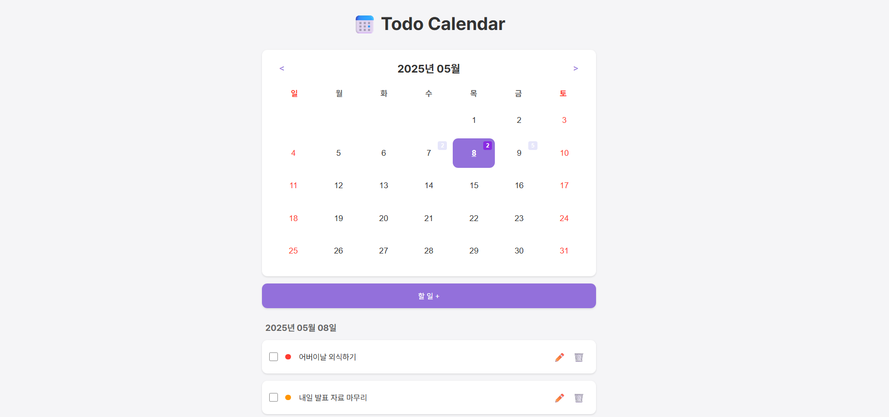

# Todo Calendar



달력과 할 일 목록이 통합된 일정 관리 웹 애플리케이션입니다.

## 1. 프로젝트 소개

### 1.1 개발 앱 설명
Todo Calendar는 사용자가 달력을 통해 일정을 시각적으로 관리할 수 있는 웹 애플리케이션입니다. 주요 특징은 다음과 같습니다:

- **직관적인 달력 인터페이스**
  - 날짜별 할 일 개수 시각화
  - 현재 월의 날짜만 표시하여 깔끔한 UI 제공

- **효율적인 할 일 관리**
  - 우선순위 기반 정렬 (HIGH > MID > LOW)
  - 완료된 할 일 자동 정렬
  - 실시간 UI 업데이트

- **사용자 친화적 기능**
  - 드래그 앤 드롭으로 할 일 순서 변경
  - 모달을 통한 직관적인 할 일 추가/수정
  - 반응형 디자인으로 모바일 지원

### 1.2 주요 기능

#### 📅 달력 기반 일정 관리
- 날짜별 할 일 목록 확인
- 날짜별 미완료 할 일 개수 표시
- 한국식 달력 표시 (일월화수목금토)
- 현재 월의 날짜만 표시

#### ✅ 할 일 관리
- 할 일 추가 (제목, 날짜, 우선순위)
- 할 일 수정 및 삭제
- 완료 여부 체크
- 우선순위별 정렬 (HIGH > MID > LOW)
- 같은 우선순위 내 생성일자순 정렬

#### 🎨 사용자 경험
- 실시간 UI 업데이트 (새로고침 불필요)
- 직관적인 UI/UX
- 반응형 디자인

### 1.3 기술 스택

#### Frontend
- React.js
- Emotion (CSS-in-JS)
- Axios (HTTP 클라이언트)
- date-fns (날짜 처리)

#### Backend
- Spring Boot
- MyBatis
- Maven

## 2. 프로젝트 구조

```
todoapp/
├── frontend/                # React 프론트엔드
│   ├── src/
│   │   ├── components/     # React 컴포넌트
│   │   │   ├── Calendar/   # 달력 관련 컴포넌트
│   │   │   ├── Todo/       # 할 일 관련 컴포넌트
│   │   │   └── UI/         # 공통 UI 컴포넌트
│   │   ├── utils/          # 유틸리티 함수
│   │   └── App.jsx         # 메인 애플리케이션
│   └── package.json
│
└── src/                    # Spring Boot 백엔드
    └── main/
        ├── java/
        │   └── com/todoapp/
        │       ├── controller/
        │       ├── service/
        │       ├── repository/
        │       └── model/
        └── resources/
            └── application.properties
```

## 3. 실행 방법

### 3.1 데이터베이스 설정
1. MariaDB 데이터베이스 생성
   ```sql
   CREATE DATABASE todo_db;
   ```

2. application.properties 설정
   - `src/main/resources/application.properties` 파일에서 다음 설정 확인:
   ```properties
   spring.application.name=todoapp
   server.port=8082

   # DB
   spring.datasource.driver-class-name=com.p6spy.engine.spy.P6SpyDriver
   spring.datasource.url=jdbc:p6spy:mariadb://localhost:3307/todo_db
   spring.datasource.username=your_username
   spring.datasource.password=your_password
   ```

3. MyBatis 설정
   - `src/main/resources/mapper/TodoMapper.xml` 파일이 있는지 확인
   - 필요한 SQL 쿼리가 정의되어 있는지 확인

### 3.2 백엔드 실행
1. 프로젝트 클론
   ```bash
   git clone https://github.com/Youjeen-Lee/todo_calendar.git
   cd todoapp
   ```

2. Spring Boot 애플리케이션 실행
   - Windows:
     ```bash
     mvnw.cmd spring-boot:run
     ```
   - Mac/Linux:
     ```bash
     ./mvnw spring-boot:run
     ```
   - 정상 실행 시 콘솔에 "Started TodoappApplication" 메시지 표시

### 3.3 프론트엔드 실행
1. frontend 디렉토리로 이동
   ```bash
   cd frontend
   ```

2. 의존성 패키지 설치
   ```bash
   npm install
   ```
   - 설치가 완료될 때까지 대기 (몇 분 소요될 수 있음)
   - 설치 중 오류 발생 시 `npm install --force` 실행

3. 개발 서버 실행
   ```bash
   npm start
   ```
   - `http://localhost:3000` 접속

### 3.4 실행 확인
- 백엔드: `http://localhost:8082`에서 API 서버 실행 확인
- 프론트엔드: `http://localhost:3000`에서 웹 애플리케이션 실행 확인

## 4. 주요 컴포넌트 설명

### 4.1 Frontend 컴포넌트

#### Calendar 컴포넌트
- **사용 이유**: 커스텀 달력 구현으로 한국식 달력 표시와 할 일 개수 표시 기능 구현
- **주요 기능**:
  - 날짜 선택 및 표시
  - 할 일 개수 배지 표시
  - 주말 색상 구분
  - 현재 월 날짜만 표시

#### TodoList 컴포넌트
- **사용 이유**: 할 일 목록의 효율적인 관리와 정렬 기능 구현
- **주요 기능**:
  - 우선순위별 정렬
  - 완료 상태 토글
  - 드래그 앤 드롭 정렬

#### TodoModal 컴포넌트
- **사용 이유**: 할 일 추가/수정을 위한 직관적인 인터페이스 제공
- **주요 기능**:
  - 할 일 정보 입력/수정
  - 우선순위 선택
  - 날짜 선택

### 4.2 Backend 컴포넌트

#### TodoController
- **사용 이유**: RESTful API 엔드포인트 제공
- **주요 기능**:
  - CRUD 작업 처리
  - 데이터 유효성 검증
  - 에러 처리

#### TodoService
- **사용 이유**: 비즈니스 로직 처리
- **주요 기능**:
  - 할 일 정렬 로직
  - 날짜 처리
  - 데이터 변환

#### TodoMapper
- **사용 이유**: MyBatis를 통한 데이터베이스 연동
- **주요 기능**:
  - SQL 쿼리 실행
  - 데이터 매핑
  - 동적 쿼리 처리

## 5. 주요 라이브러리 설명

### 5.1 Frontend 라이브러리

#### React.js
- **사용 이유**: 컴포넌트 기반 UI 개발과 상태 관리
- **주요 기능**:
  - 가상 DOM을 통한 효율적인 렌더링
  - 컴포넌트 재사용
  - 상태 관리

#### Emotion
- **사용 이유**: CSS-in-JS 방식으로 스타일 관리
- **주요 기능**:
  - 동적 스타일링
  - 컴포넌트별 스타일 캡슐화
  - 테마 지원

#### Axios
- **사용 이유**: HTTP 클라이언트로 API 통신
- **주요 기능**:
  - Promise 기반 비동기 처리
  - 인터셉터를 통한 요청/응답 처리
  - 에러 핸들링

### 5.2 Backend 라이브러리

#### Spring Boot
- **사용 이유**: 빠른 개발과 자동 설정
- **주요 기능**:
  - 의존성 주입
  - 자동 설정
  - 내장 서버

#### MyBatis
- **사용 이유**: SQL 매핑 프레임워크
- **주요 기능**:
  - XML 기반 SQL 관리
  - 동적 SQL
  - 결과 매핑

#### MariaDB
- **사용 이유**: 안정적인 관계형 데이터베이스
- **주요 기능**:
  - 데이터 영구 저장
  - 트랜잭션 관리
  - 인덱싱

#### Lombok
- **사용 이유**: 보일러플레이트 코드 감소
- **주요 기능**:
  - Getter/Setter 자동 생성
  - Builder 패턴 지원
  - 로깅 어노테이션

#### Spring Boot Validation
- **사용 이유**: 데이터 유효성 검증
- **주요 기능**:
  - 입력값 검증
  - 커스텀 유효성 검사
  - 에러 메시지 처리

#### Spring Boot DevTools
- **사용 이유**: 개발 생산성 향상
- **주요 기능**:
  - 자동 재시작
  - 라이브 리로드
  - 개발 환경 최적화

#### P6Spy
- **사용 이유**: SQL 쿼리 로깅 및 모니터링
- **주요 기능**:
  - SQL 쿼리 로깅
  - 실행 시간 측정
  - 쿼리 성능 분석

## 6. 테스트케이스

### 6.1 Frontend 테스트
- Jest와 React Testing Library를 사용하여 컴포넌트 테스트
- 주요 테스트 항목:
  - Calendar 컴포넌트: 날짜 선택, 할 일 개수 표시
  - TodoList 컴포넌트: 할 일 추가, 우선순위 정렬
  - TodoModal 컴포넌트: 입력 폼 검증

### 6.2 Backend 테스트
- JUnit5와 Mockito를 사용하여 서비스 및 컨트롤러 테스트
- 주요 테스트 항목:
  - TodoService: 할 일 추가/수정/삭제, 우선순위 정렬
  - TodoController: API 엔드포인트 동작 검증

  
## 7. API 엔드포인트

- `GET /api/todos` - 모든 할 일 조회
- `POST /api/todos` - 새로운 할 일 추가
- `PUT /api/todos/{id}` - 할 일 수정
- `DELETE /api/todos/{id}` - 할 일 삭제

## 8. 컴포넌트별 CSS 스타일링

### 8.1 Calendar 컴포넌트
- 달력 컨테이너: 최대 너비 800px, 중앙 정렬
- 날짜 셀: hover 시 배경색 변경, 선택된 날짜 강조
- 요일 헤더: 주말 색상 구분
- 할 일 개수 표시: 우측 상단에 배지 형태로 표시

### 8.2 TodoList 컴포넌트
- 할 일 항목: 카드 형태, hover 시 약간 위로 이동
- 우선순위 표시: 색상으로 구분 (HIGH: 빨강, MID: 주황, LOW: 초록)
- 완료된 항목: 회색 처리 및 취소선
- 체크박스: 커스텀 스타일링

### 8.3 TodoModal 컴포넌트
- 모달 배경: 반투명 오버레이
- 모달 컨테이너: 흰색 배경, 그림자 효과
- 입력 필드: 테두리, 포커스 효과
- 버튼: 호버 효과, 색상 구분

### 8.4 공통 UI 컴포넌트
- 버튼: 테두리 반경, 호버 효과
- 헤더: 중앙 정렬, 아이콘 포함
- 섹션: 여백, 구분선


